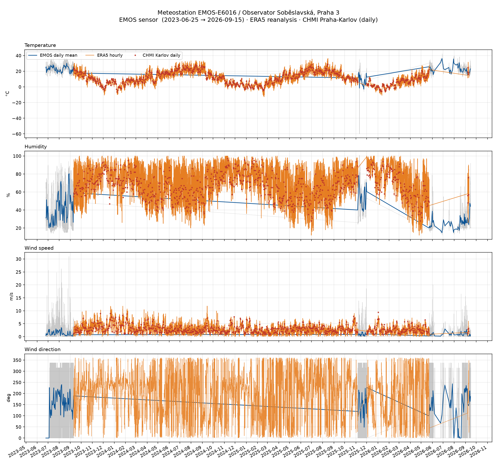

# Meteodata — Observator Soběslavská, Praha 3

Historical weather data for the observatory on Soběslavská street, Praha 3
(50.0877°N, 14.4428°E), merged from three sources into `data/meteo.csv`:

| Source | Resolution | Period | Rows | id |
|---|---|---|---|---|
| **EMOS-E6016** sensor, RTL-SDR / rtl_433 | ~1 min | 2023-06-25 → 2026-09-15 | 178,996 | 108/212, 87, 75, 131 |
| **CHMI Praha-Karlov** (WSI `0-20000-0-11519`, ~2.1 km) | daily | gap periods | 967 | 11519 |
| **Open-Meteo ERA5** reanalysis | hourly | gap periods | 23,208 | ERA5 |

Total **203,171 records**, covering **2023-06-25 → 2026-09-15** continuously.

## Data

Columns: `time, source, id, battery_ok, temperature_C, humidity,
wind_avg_m_s, wind_dir_deg`.

- `source`: `sensor` (EMOS station), `chmi` (CHMI Praha-Karlov daily),
  `era5` (Open-Meteo ERA5 hourly reanalysis).
- The EMOS station id changes over time (108/212 → 87 → 75 → 131), likely
  battery swaps in the outdoor unit.
- Gaps caused by logging outages (**2023-09-10 → 2025-11-06**,
  **2025-12-01 → 2026-05-23**, 2026-09-07 → 10) are filled by CHMI daily data
  and ERA5 hourly reanalysis. CHMI daily has no wind-direction value;
  ERA5 provides direction hourly.
- Raw files overlap (e.g. 2026-07-30); `scripts/merge.py` deduplicates by
  `(time, source, id)`.
- `battery_ok: 0` in the Nov 2025 batch indicates that battery was low.

## Plots

`plots/meteo_history.png` — temperature, humidity, wind speed and wind
direction time series. Sensor readings grey with daily-mean overlay (blue),
gap-filling ERA5 hourly orange, CHMI daily red:



## Reproducing

```sh
python3 scripts/fetch_external.py  # re-download CHMI + ERA5 gap data (network)
python3 scripts/merge.py           # rebuild data/meteo.csv from data/raw/
python3 scripts/plot.py            # regenerate plots/meteo_history.png
```

Requires Python 3 + matplotlib. No pandas needed.

## Sources / attribution

- **EMOS-E6016** — local weather station received via RTL-SDR; upstream parser
  `rtl_sdr-weather_data_parser` (GPLv3). Logged on a Raspberry Pi, retrieved:
  ```
  ssh pi 'sudo cat /root/rtl_sdr-weather_data_parser/<file>.json'
  ```
  (`backup2.json`, `weather_data_all.json` in `/var/log`, `backup.json`,
  `graph.json` — the live file). The 2023 epoch (`2023_graph.json`) was
  recovered from the previous backup repo `K0F/meteodata`.
- **CHMI** — Český hydrometeorologický ústav, daily climatological data,
  *Praha, Karlov* (WSI `0-20000-0-11519`), from
  [opendata.chmi.cz](https://opendata.chmi.cz). Used under
  [CC BY 4.0](https://creativecommons.org/licenses/by/4.0/).
- **Open-Meteo** — ERA5 reanalysis (ECMWF/Copernicus) via the
  [Historical Weather API](https://open-meteo.com/en/docs/historical-weather-api).
  Used under [CC BY 4.0](https://creativecommons.org/licenses/by/4.0/).